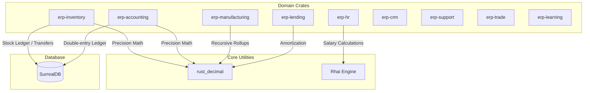

# Diagrams: erpnext-domain

The diagram below outlines the core relationships between the domain logic crates and how database persistence / calculations flow through the system:

```mermaid
graph TD
    subgraph Domain Crates
        Accounting[erp-accounting]
        Inventory[erp-inventory]
        Manufacturing[erp-manufacturing]
        HR[erp-hr]
        Lending[erp-lending]
        CRM[erp-crm]
        Support[erp-support]
        Trade[erp-trade]
        Learning[erp-learning]
    end

    subgraph Core Utilities
        Decimal[rust_decimal]
        Rhai[Rhai Engine]
    end

    subgraph Database
        SurrealDB[(SurrealDB)]
    end

    Inventory -->|Precision Math| Decimal
    Accounting -->|Precision Math| Decimal
    Manufacturing -->|Recursive Rollups| Decimal
    Lending -->|Amortization| Decimal
    HR -->|Salary Calculations| Rhai
    Inventory -->|Stock Ledger / Transfers| SurrealDB
    Accounting -->|Double-entry Ledger| SurrealDB
```
