# ERPNext Domain Logic Engine (Rust Edition)

This workspace houses the computational, non-I/O domain engine of the refactored ERPNext platform. All models and transactions are completely decoupled from database queries, following clean domain-driven design (DDD) principles.

## Core Pillars

```mermaid
graph TD
    subgraph Accounting [erp-accounting]
        GL[Double-Entry Posting] -->|Discrepancy Check| UnbalancedError[LedgerError::UnbalancedEntry]
        Rollup[CoA Rollup Tree] -->|Recursive Sum| ConsolidatedBalance[Trial Balance Output]
    end

    subgraph Inventory [erp-inventory]
        FIFO[FIFO Queue Depletion] -->|COGS Calculation| StockIssue[Stock Dispatches]
        GraphTransfers[Graph Stock Transfers] -->|Transaction Edge DDL| SurrealEdges[shipped_from / received_at]
    end

    subgraph Manufacturing [erp-manufacturing]
        BOM[Recursive BOM Costing] -->|Phantom Node Expansion| TotalCost[Manufactured Component Cost]
        MRP[Tokio Parallel MRP Pipeline] -->|Shortage Calculations| SupplyOrders[MRP Planning Results]
    end

    subgraph HumanResources [erp-hr]
        Payroll[Dynamic Salary Calculator] -->|Rhai Scripting| SalarySlips[Salary Slip Generation]
        Tax[Progressive Tax Engine] -->|Slab Rules| Deductions[Tax Deductions]
    end

    subgraph CRM [erp-crm]
        Scoring[Lead Scoring Engine] -->|Weighting Rules| LeadScore[Lead Quality Score]
        Pipeline[Sales Pipeline Funnel] -->|State Transitions| DealStage[Deal Stage Tracking]
    end
```

---

## Features & Modules

### 1. General Ledger Core (`erp-accounting`)
- **Atomic Double-Entry Posting (`posting.rs`)**: Enforces absolute balance consistency on transaction postings. Ensures debits and credits sum up to zero:
  $$\sum \text{Debits} - \sum \text{Credits} = 0$$
  If an entry is unbalanced, it rejects the posting with a detailed `LedgerError::UnbalancedEntry` containing the exact discrepancy value. Generates atomic database queries to log entries and update balances concurrently.
- **Recursive Chart of Accounts Rollup (`balance_sheet.rs`)**: Aggregates ledger account balances across composite tree nodes recursively to calculate trial balances and consolidated balance sheets.

### 2. High-Performance Inventory (`erp-inventory`)
- **FIFO Valuation Queue (`stock_ledger.rs`)**: Implements First-In, First-Out valuation strategies using sorted timestamp queues. Issues deduct stock quantities from older items first, computing dynamic Cost of Goods Sold (COGS) based on historical rates.
- **Graph-Relational Stock Transfers (`transfers.rs`)**: Constructs transactional stock movement records, compiling SurrealQL queries that link transactions to warehouses via graph relations (`shipped_from`, `received_at`) to preserve inventory change history.

### 3. Bills of Materials & MRP (`erp-manufacturing`)
- **Recursive BOM Cost Rollup (`bom.rs`)**: Traces material requirement trees dynamically. Cost calculations expand "Phantom BOM" items inline recursively to roll up accurate sub-assembly routing costs:
  $$\text{TotalParentCost} = \sum \left( \text{Qty}_{\text{Component}} \times \text{Rate}_{\text{Component}} \right) + \sum \text{RoutingCost}$$
- **Tokio Parallel MRP Pipeline (`mrp.rs`)**: Spawns concurrent tasks using Tokio channels to scan order demands against warehouse stock balances to compute shortages.

### 4. Human Resources (`erp-hr`)
- **Dynamic Salary Calculation (`payroll.rs`)**: Computes salary slips using the Rhai scripting engine to dynamically evaluate earning/deduction formulas. Supports complex, user-defined salary structures.
- **Progressive Tax Engine (`payroll.rs`)**: Calculates income tax based on configurable, multi-layered tax slabs.
- **Payroll Batch Posting (`payroll.rs`)**: Generates balanced double-entry GL postings for an entire payroll batch, ensuring accounting consistency.

### 5. Customer Relationship Management (`erp-crm`)
- **Lead Scoring Engine (`lead_scoring.rs`)**: Assigns scores to leads based on configurable rules and weights to prioritize high-value prospects.
- **Sales Pipeline Management (`pipeline.rs`)**: Tracks deal stages and funnel progression.

---

## High-Precision Math Guarantee

To prevent float drift errors in business applications, all currency values, tax calculations, routing costs, inventory rates, and quantities are modeled using high-precision decimal representation via `rust_decimal::Decimal` pinned to `=1.42.0` with `maths` feature flags enabled.
